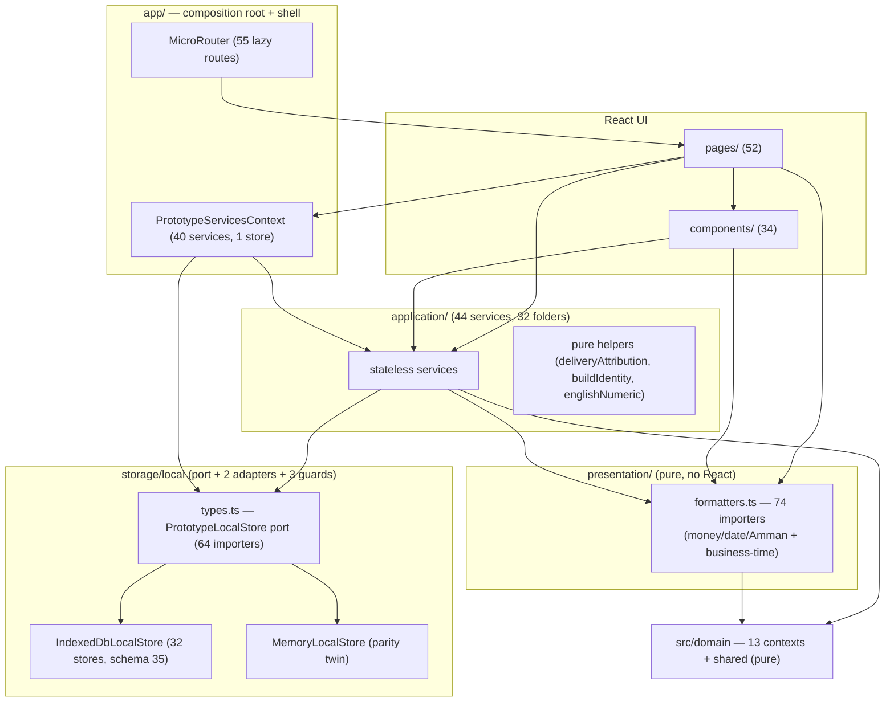
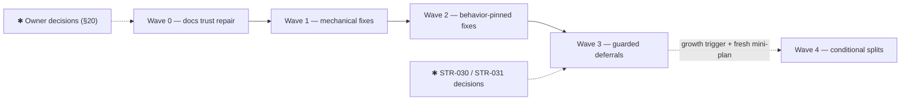

# Micro Structure, Architecture, and Code Organization Scan — v1

| | |
|---|---|
| **Report ID** | Group 7 — Structure/Architecture/Code Organization Scan (read-only) |
| **Micro repository** | https://github.com/Qays7753/Micro |
| **Branch scanned** | `remediation/micro-full-hardening-2026` |
| **Exact HEAD scanned** | `9a8c949e56f92259753079a0098a32d52ea079ff` (Group 6-complete head; verified live) |
| **Pull request** | #159 — verified open and unmerged |
| **Scan date** | 2026-09-11 (UTC+3) |
| **Nature of this run** | Read-only analysis. **No Micro file was changed. No remediation was executed.** |
| **Delivered to** | Documentation repository, `audits/micro/structure-architecture-code-organization-scan-v1.md` |

---

## 1. Executive summary

This scan answers one question: **can a developer or a future AI agent locate, understand, test, and safely change any Micro feature without searching blindly across the repository or mixing architectural layers?** After a full read-only pass over all 407 source files (1,433 import edges analyzed), all 235 documentation files, and thirteen features traced end-to-end from route to storage, the answer is **yes — with a small, precisely bounded set of exceptions that are listed, evidenced, and classified in this report.**

The headline finding is positive and important to state first: **Micro's architecture is genuinely as designed, not merely aspirational.** The domain core (14 contexts, 44 files) is provably pure — zero external imports, zero browser access, enforced by ESLint rules that are themselves proven by tests running the real ESLint engine. The storage layer is a single typed port (`PrototypeLocalStore`) with two interchangeable adapters (IndexedDB and in-memory) that share one set of pure concurrency guards, with adapter parity demonstrated by a conformance test suite. The application layer (44 services) is React-free and stateless, and everything is wired in one small, readable composition root (235 lines) that constructs 40 services over one store instance. Financial safety is concentrated in 28 multi-store atomic commit methods at the port, and import/export compatibility for every released data version is pinned by dedicated fixtures. For a local-first financial prototype maintained by a solo owner working with AI agents, this is a strong structural position.

The problems the scan found are **not architectural rot**; they fall into four small groups. First, **documentation drift**: the agents' entry document (AGENTS.md) still says a correction path does not exist when it was implemented and tested in Group 3; decision-log status flags lag behind reality; one architecture document's counts are one release behind; and six contract numbers (18–23) are each claimed by two different files, while contracts 30–39 are referenced throughout the code but do not exist as files. These are cheap, safe, high-trust repairs. Second, **a handful of tiny type- and helper-level inversions**: one data type owned by a UI component but consumed by the application layer; one domain type (`WasteContext`) defined identically in two domain contexts; the Amman-timezone date conversion re-implemented nine times (with one verified behavioral divergence in quantity-to-milli conversion at the floating-point boundary). Third, **guard coverage gaps**: three parallel route lists with no sync test, the `app/` shell layer exempt from the storage-import guard, and the Math-rounding ban not covering the application layer. Fourth, **deferred structural watch-items** — the two large adapters (3,899 and 1,563 lines) and the transfer service (3,011 lines) are big but cohesive, guarded, and tested; the scan classifies them as **Preserve** with named, characterization-test-gated directions for the future, not as defects requiring action now.

The report proposes **four remediation waves** (documentation trust repair → tiny mechanical fixes → behavior-pinned micro-fixes → guarded deferrals), each with explicit acceptance criteria, rollback boundaries, and a "no financial semantic change" proof requirement. It also lists **eight owner decisions** that must be made before any wave begins — including explicitly rejecting a `features/` layer reorganization at this stage, which the evidence indicates would add indirection without adding safety. **No structural work of any kind was performed in this run, and none may begin until the owner accepts these findings.**

---

## 2. Scope, non-goals, and read-only guarantee

### 2.1 What this scan is

Group 7 is the post-program gate documented in `AGENTS.md` §11 and `todo.md` (line 117): a comprehensive, read-only Structure/Architecture/Code Organization Scan performed after the completion of Group 6 of the full-hardening program. Its purpose is to understand the current system, identify real structural risks, define a target module map, and propose the minimum safe remediation plan. It is an input to an owner decision — it is not authorization to change anything.

### 2.2 Read-only guarantee (what was and was not done)

The following guarantees were enforced mechanically during this run and can be relied upon:

- **No Micro file was changed.** The scan operated on a local clone whose push URL was disabled (`DISABLE_PUSH_NO_WRITES_ALLOWED`) and whose files were made read-only (`chmod -R a-w`) before specialist agents were launched. The final working-tree state was verified clean (`git status --porcelain` = 0 entries, HEAD = `9a8c949`, identical to the live remote branch head).
- **No Micro branch, PR, commit, push, or tag was created or modified.** All git usage against Micro was read-only (`ls-remote`, `log`, `show`, `diff`, `blame`).
- **No dependency was added and no analysis script was placed inside Micro.** All scan tooling lives in the scanning workspace (`/home/z/my-project/scripts/`), outside the repository.
- **No tests, builds, or linters were executed against the repository** (the tree was never installed or mutated); CI evidence is taken from the live GitHub status for the exact scanned commit (Actions run `34559762292`, all steps green, plus the Cloudflare Pages build) and from the Group 6 closure record, which pins the full local validation (`pnpm check` exit 0) on the same commit.
- **The only write produced by this run** is this single report file, delivered to the documentation repository's audit branch. No second report, specialist-report folder, or index file was created.

### 2.3 Non-goals and explicit out-of-scope boundaries

This scan does not authorize, and did not perform: financial rule changes; new product capabilities; Auth/Workspace/RLS/Cloud/Sync/Multi-user/SaaS/Billing/Pilot/Android-iOS/AI/POS/ERP/CRM/LMS/Market/Delivery scope; schema or export/import format changes (schema 35 / export 27 remain frozen); data migrations; data deletion; broad code cleanup; dependency upgrades; visual redesign; performance optimization without measurement; any merge to `main`; or any structural refactoring before this report is accepted by the owner. Findings that would require such work are recorded and classified (mostly *Out of scope*), not implemented. If a severe functional or financial defect had been discovered, it would have been recorded as a separate finding with a recommendation — none requiring emergency action was found.

---

## 3. Baseline and evidence

### 3.1 Group 6 completion verification (precondition gate)

Every precondition was verified against the **live** repository state before scanning began:

| # | Precondition | Verified evidence |
|---|---|---|
| 1 | Approved branch is current | `git ls-remote`: `remediation/micro-full-hardening-2026` @ `9a8c949e…` — identical to the clean local clone (0/0 divergence) |
| 2 | Group 6 commits present | 5 commits on top of Group 5 head `2292f05`: `e40a639` (guards+manifest+wiring), `37b02da` (layer-boundary proof tests), `8f23045` (AGENTS §10/§11), `3ac33bb` (PR templates), `9a8c949` (operations closure + governance tests) |
| 3 | Group 6 final report/closure present | `docs/operations/current-state.md` §36 (full closure table), `todo.md` Group 6 entry `[x]` (line 116), `AGENTS.md` §10–§11 |
| 4 | Group 6 CI green | Live Actions badge for the branch reads "CI - passing"; Actions run `34559762292` on `9a8c949` recorded all-green (lint 37/37, typecheck, guards, domain+scripts 340/340, prototype 1,075/1,075, bundle gate 634,314/650,000 raw and 150,058/155,000 gzip); Cloudflare Pages build succeeded on the same SHA |
| 5 | PR #159 open and unmerged | `refs/pull/159/head` = `9a8c949` (current with branch head); live `refs/pull/159/merge` present (GitHub maintains merge refs only for open PRs); `main` still at baseline, so no merge occurred |
| 6 | `main` not modified | `main` @ `4af025d38f04dfb36ee645a4f9ca3345e362bf5b` — exactly the documented baseline |
| 7 | No unrelated work mixed | 26 commits since `main`, all belonging to hardening Groups 1–6 (subjects verified) |
| 8 | Group 6 report states this scan is the next owner-gated phase | `todo.md` line 117: post-program read-only structural scan gate, "not started", owner approval required, referencing `AGENTS.md` §11; `current-state.md` §36 "بوابة ما بعد المجموعة ٦" row; `AGENTS.md` §11 heading "المسح الهيكلي للقراءة فقط (إلزامية وموثقة، لم تبدأ)" |
| 9 | Scan not already executed | Zero commits after `9a8c949` on the branch; documentation repository contains no `audits/` path and no audit branch (only `main` and an unrelated `claude-mobile-visual-research-v1`) |

**Result: all preconditions PASS. The scan proceeded on the Group 6-complete head.**

### 3.2 Scan tooling and evidence base

| Evidence source | Detail |
|---|---|
| Static import/structure scanner | Custom Python script (workspace-local, never inside Micro): parsed **407 source files**, extracted imports (runtime vs `import type`, including dynamic `import()`), exported symbols, browser-global references, per-file lines/bytes, and layer classification; produced the full edge list (**1,433 edges, 770 production**), Tarjan SCC cycle detection, fan-in/fan-out maps, direct-test-importer maps, and duplicate-export detection |
| Four read-only specialist agents | Specialist 1 (module/feature map), Specialist 2 (dependency/layer/composition/cycles), Specialist 3 (oversized files/duplication/sources of truth), Specialist 4 (discoverability/traceability/adversarial review) — each read the live repository directly and returned evidence-cited findings |
| Lead verification | The lead re-verified every load-bearing claim independently: recounting pages/routes/services/wiring/tests; re-deriving the quantity-conversion divergence mathematically; byte-checking the `WasteContext` duplication; confirming the AGENTS.md staleness, contract numbering collisions, and fixture wiring by direct reads |
| Live remote state | `git ls-remote` (branch/PR refs), Actions badge (CI status), plus the Group 6 closure record for local validation numbers |

### 3.3 Reconciled baseline numbers (authoritative)

These figures were re-derived by direct enumeration during synthesis and supersede any intermediate counts: **717 tracked files**; **407 parsed source files**; **14 domain contexts** (13 bounded + `shared`); **52 production pages** mounted on **55 route patterns** (+1 redirect, all 52 pages lazy-loaded); **34 production component files**; **32 application feature folders** containing **44 `*Service.ts` files**, of which **40 are wired in the composition root** (verified exceptions: `capacityDecisionService` and `shareMessageService` are pure-function modules; `statementMarkdownService` is constructed inside `Statement.tsx`; `localDiagnosticsService` is a module-level singleton); **20 storage-layer files** (port types + 2 adapters + 3 commit guards + factory + tests); **12 app-shell files**; **180 test files** (150 in the app source tree, 23 domain suites in `tests/`, 2 in-domain policy tests, 4 root guard-script tests, 1 app build-script test); **32 IndexedDB object stores**; **schema 35 / export 27**; **235 documentation files**; lint ceiling **37 warnings** (exactly consumed); bundle budget **650,000 / 155,000 bytes** (last measured build 634,314 / 150,058 — inside budget).

---

## 4. Five specialist findings and reconciliation

### 4.1 Specialist summaries

- **Specialist 1 (modules & features)**: The module map is coherent. All thirteen representative features trace cleanly from route → page → application service → domain policy → storage port → tests → contracts with **no missing links in the core paths**. The composition root is "the strongest structural asset." Fifteen findings, predominantly *Preserve*/*Defer*, with two *Fix-now* documentation items and three tiny type-ownership moves proposed.
- **Specialist 2 (dependency & layers)**: The layer direction is verified as intended at runtime everywhere except **five precisely-bounded exceptions**, all itemized (one type-only application→component import; 18 runtime application→presentation imports that are a placement question rather than a rule breach; one type-only presentation→application edge; one legitimate `app/StartupGate → persistentStorage` runtime edge outside guard coverage; four pure UI→domain helper calls). Exactly one import cycle exists and it is **type-only** (erased at compile time). The unenforced-boundary gaps are catalogued with concrete ESLint-able remedies.
- **Specialist 3 (composition & duplication)**: Of 15 oversized files analyzed, only two are structurally multi-responsibility by design (the IndexedDB adapter and its in-memory twin — a *compatibility hub* pair; and the Catalog page — four entity families in one component); everything else is large because its single job is large. Sources of truth are mostly consolidated (money formatting has exactly one `Intl` source); the real duplication findings are the **Amman-date algorithm (9 implementations)** and the **quantity-to-milli conversion (4 implementations, 1 verified behavioral divergence)**.
- **Specialist 4 (discoverability & adversarial)**: Traceability matrix completed for all 13 features; documentation accuracy verified sample-by-sample with four concrete staleness findings; no dead code found with strong evidence (every production file has an importer; entry points are by-design roots). The adversarial pass rejects cosmetic refactors, names five categories of proposals that would *increase* risk, and returns **GO** for report readiness with five merge conditions (all satisfied below).

### 4.2 Reconciliation of disagreements (resolved against live code)

| Disagreement | Resolution (evidence) |
|---|---|
| Wired-service count: 41 (S1) vs 40 (S4) vs 39 (first lead count) | **40** — direct enumeration of `new *Service(` in `PrototypeServicesContext.tsx` by script; matches ARCHITECTURE.md's "40 services wired" |
| Test-file count: 148 (lead's first census) vs 180 (S1/S4) | **180** — `git ls-files | rg '\.test\.(ts\|tsx\|mjs)$'`; the first census used an under-matching pathspec glob |
| Application feature folders: 36 (lead's first census) vs 32 (S1/S4) | **32** — the first awk pass counted 4 root-level test *files* as "folders" |
| Route count: 57 (S4) vs 55 (lead) | **55 distinct `<Route path>` patterns** + 1 `<Redirect>`; 52 lazy page components (the `/review` pattern is itself the redirect target holder) |
| "42 domain files have no tests" (raw scanner artifact) | **Not a gap** — domain `policies/types` files are covered through the per-context barrels imported by the 23 `tests/domain/` suites; the barrel export surface is itself lock-tested (`tests/domain/public-surface.test.ts`) |
| "`confirm(` = browser dialog in application layer" (scanner heuristic) | **False positive** — `guidedOpeningImportService.ts:336` defines a service *method* named `confirm(...)`; no `window.confirm` exists in the application layer |
| Domain "non-relative imports" (scanner: 2 hits) | **Documented ESLint exception** — the two `vitest` imports live in domain *test* files (`src/domain/*/policies.test.ts`), explicitly permitted by the Group 6 rule with the ban on `Math.round/floor` still applied inside them |
| Pages/components "browser globals" (scanner: 27 hits) | **None violate the live guard** — the ESLint rule bans *storage* access (`localStorage`/`sessionStorage` incl. `window.`/`globalThis.` member forms) from production pages/components; all 27 hits are either legitimate UI browser usage (`window.location`, `document.title`) or test files under the documented narrow exception |

### 4.3 Merge conditions from the adversarial review (S4 §4.9) — all satisfied

1. Counts reconciled to the verified baseline (§3.3). 2. The `confirm(` false positive is corrected and does not appear as a finding. 3. Barrel-covered domain files are treated as covered. 4. Owner-decision items are separated from technician-executable fixes (§20). 5. The report bundles no structural remediation into this run (§21). The named safety assets (released-pair import tests, adapter conformance, barrel lock, doc-governance tests, in-build bundle gate, honest deferred-gap disclosures) are all explicitly recognized in §13 and §16.

---

## 5. Current repository and package map

### 5.1 Root layout

| Path | Files | Role | Assessment |
|---|---|---|---|
| `src/domain/` | 44 | Domain core: 13 bounded contexts + `shared` (money/quantity/date/rounding primitives) | Coherent; ESLint-enforced purity (relative-only imports, no browser globals, D-02 rounding ban) |
| `apps/prototype-web/` | 353 | The web client: `client/src/` (application/pages/components/storage/app/presentation/pwa/lib/contexts) + build config + one build script | Coherent; see §5.2 |
| `docs/` | 235 | Contracts (35), quality (66 incl. entity-touchpoints manifest), expansion (34), product (19), decisions (17), research (12), operations (10), inventory (10, historical), implementation (9), product-audit (6), scenarios (2), reference (1), fixtures (1) | Rich; number-collision and staleness findings in §13/§16 |
| `tests/` | 23 | Domain truth suites (`tests/domain/*.test.ts`) + public-surface lock | Coherent — tests target barrels (the public API), which is correct |
| `scripts/` | 10 | CI guard chain: `check-secrets.mjs`, `check-test-focus.mjs`, `check-entity-touchpoints.mjs` (+4 self-test files, text-density + design-token python guards) | Coherent; wired into `pnpm guards` inside `pnpm check` |
| `ai-skills/`, `.agents/`, `.github/`, `qa/` | 27/3/2/1 | Agent skill notes, agent config, CI workflow + PR template, QA notes | Small; no ambiguity found |
| Root manifests | 6 | `package.json` (root scripts incl. the full `pnpm check` chain), `pnpm-workspace.yaml` (packages: `apps/*`), `eslint.config.js`, `tsconfig.json`, `vitest.config.ts`, `todo.md` | Coherent; the domain is compiled/tested from the root project, the app from its own package — the `@micro-domain/*` alias bridges them (mapped in both tsconfig paths and the app vitest config) |

**Source vs. generated/test artifacts**: no build outputs are tracked (dist is gitignored); tests are co-located per layer plus two dedicated roots (`tests/`, `scripts/*.test.mjs`) — this is a deliberate, documented pattern, not sprawl. **Ambiguous top-level locations**: none material; `ai-skills/` and `qa/` are legacy-adjacent but harmless and clearly named.

### 5.2 The web client layout (`apps/prototype-web/client/src/`)

| Layer dir | Prod files | Role |
|---|---|---|
| `app/` | 12 | Composition root (`PrototypeServicesContext.tsx`, 235 lines, wires 40 services), router (`MicroRouter.tsx`, 55 lazy routes), navigation contracts (`navigation.ts`, `navigationContract.ts`, `routeClassifier.ts`), boot gates (`StartupGate.tsx`), shared UI logic (`useReturnNavigation.ts`, `resultFeedback.ts`) |
| `application/` | 133 (44 services + helpers, 32 feature folders) | Use cases and read models over the store port; stateless classes; React-free (enforced) |
| `storage/local/` | 20 | `types.ts` (the `PrototypeLocalStore` port + snapshot + constants 35/27), `IndexedDbLocalStore.ts` (3,899 lines, 32 stores), `MemoryLocalStore.ts` (1,563 lines), 3 pure commit guards, `createBrowserLocalStore.ts` factory, `persistentStorage.ts` |
| `pages/` | 52 | Route surfaces (largest: `Catalog.tsx` 2,120, `OrderDetail.tsx` 1,735, `OwnerEntitlement.tsx` 1,590, `Finance.tsx` 1,440) |
| `components/` | 34 | Form kernel (`UnsavedChangesGuard` 27 importers, `EnglishNumberInput` 32, `LocalDateField` 24, `useFormDirty` 20), finance panels, layout, presentation primitives (`DisplayValue` 46 importers), security gates |
| `presentation/` | 10 (6 pure + 4 tests) | Pure formatting/label kernel: `formatters.ts` (74 importers — money/date/Amman), `plurals.ts`, `g5Plurals.ts`, `activityLabels.ts`, `orderAgreementPresentation.ts`, `cashCountMessages.ts` |
| `pwa/` | 9 | SW registration, install prompt, update flow with dirty-form protection |
| `lib/`, `contexts/` | 3 + 1 | `utils.ts` (clsx merge), `textDelivery.ts`; `ThemeContext` |

---

## 6. Current module and feature map

### 6.1 Domain contexts (all 14)

| Context | Owns | Public surface (barrel `index.ts`) | Consumers |
|---|---|---|---|
| `craft-order` | Order lifecycle, cost snapshots, deposits/debt, delivery + reversal (D-031), price revision, cancel, retained-deposit classification | `createCraftOrder`, `transitionOrder`, `collectDeposit`, `reverseDelivery`, `calculateCostSnapshot`, … (21 policy functions) | Fulfillment, DeliveryReview, Collection, Draft, Cost services |
| `financial-event` | The 8-type `DELTA_TABLE` — single source of financial deltas; event creation/reversal/summaries/settlements | `createFinancialEvent`, `createFinancialReversal`, `summarizeFinancialEvents`, `activeSettlementsMinor` | ProjectFinancial, CorrectionHistory, all finance surfaces |
| `cash-continuity` | Wallets, entries, allocation guards | `createCashWallet`, `createCashContinuityEntry`, `summarizeCashContinuity` | CashContinuity, WalletLedger, Collection services |
| `inventory-material` | Materials, dated movements, non-negativity fold, shortages, activations, `WasteContext` | 19-method service surface over the domain policies | InventoryMaterial service |
| `catalog` | Reference items, units, conversions, templates | item/unit/conversion/template policies | Catalog, Cost services |
| `supplier-purchase` | Purchases, payments, reversals, revisions | create/record/reverse policies | SupplierPurchase service (+ commit guard) |
| `asset` / `loan` | Depreciation records; loan records and repayments | create/revise/correct/depreciate/dispose; create/recordRepayment | Asset/Loan services |
| `owner-entitlement` | Owner money ledger records, successors, withdrawals | entitlement policies | OwnerEntitlement service |
| `direct-sale` | Cash/credit direct sales with optional standalone customer | create/revise/cancel | DirectSale service |
| `g5` | Period-declaration (breakeven) calculus | declaration/reversal policies | G5 service |
| `actual-time` | Actual-time readings | reading policies | ActualTime service |
| `recurring-margin` | Recurring margin entries (reuses `WasteContext` shape) | entry policies | RecurringWork service |
| `scheduling` *(by design: no domain context — see note)* | — | — | — |
| `shared` | `quantityMilliExact`, `roundHalfUp` + friends (D-02-approved rounding), `isValidLocalDate`, money assertion helpers | numeric/date primitives | All contexts + application |

*Note*: scheduling is a deliberate documented exception — schedules are local operational follow-ups with no financial effect, so they have no domain context (types are declared in `storage/local/types.ts`). This is intentional scope, not a missing layer.

### 6.2 Application feature folders (32) and their services

`finance` (5 services incl. `projectFinancialService` — the read-model kernel, 13 fan-in, `integrityCheckService`, `ownerEntitlementService`, `statementService`, `correctionHistoryService`, `statementMarkdownService`) · `transfers` (localTransferService, guidedOpeningImportService) · `fulfillment` (fulfillmentService, deliveryReviewService, deliveryAttribution — a shared pure helper) · `agreements` · `scheduling` (scheduleService, recurrenceService, capacityDecisionService) · `drafts` (draftService, formDraftService, legacyFormDraftMigration) · `inventory` (inventoryMaterialService, materialSuggestions) · `home` (homeControlCenterService — type-only aggregator of 6 services) · `collections` (collectionService, collectionReversalService) · `cash` (cashContinuityService, walletLedgerService) · `catalog`, `cost`, `estimates`, `direct-sales`, `assets`, `loans`, `owner`, `parties`, `profile`, `preferences`, `suppliers`, `security` (localLockService), `diagnostics` (localDiagnosticsService), `identity` (buildIdentity), `input` (englishNumeric), `time`, `activity`, `follow-up`, `share` (shareMessageService), `g5`, `recurring-work`, `financial-pulse`, `agreement-context`.

### 6.3 Boundary quality summary

Every module boundary was assessed as **coherent** with these exceptions, all small and evidence-cited: `presentation/formatters.ts` (dual role — display formatting vs business-time supply; §11, STR-031); `MaterialSuggestion` type owned by a component (STR-005); `WasteContext` duplicated across two contexts (STR-030); the route knowledge split across four modules (STR-010); the port's type-only cycle with a guard (STR-023, benign); the adapters as a compatibility-hub pair (Preserve with a named future direction, STR-034).

---

## 7. Feature discoverability and traceability matrix

Legend: ✅ verified link · ⚠ partial/indirect · ❌ missing. "Must-not-touch" files per feature are listed in §7.1.

| Feature | Route/Page | UI entry | Application use case | Domain policy | Storage port/adapter | Tests that prove it | Contract/docs | Discoverability issue |
|---|---|---|---|---|---|---|---|---|
| Orders & delivery | `/orders`, `/orders/new`, `/orders/draft/:id{,/cost,/agreement}`, `/orders/:id`, `/orders/:id/deliver` | Bottom nav + FAB + Home today-list | FulfillmentService, DeliveryReviewService (+ CollectionService) | `craft-order` transitions, `reverseDelivery` (D-031), `collectRemaining/collectRegisteredDebt`, `reviseAgreedPrice` | `commitOrderDelivery` / `commitOrderDeliveryReversal` (atomic multi-store) | 5 domain suites + fulfillment/deliveryReview/lockedReview/reviewLockBoundary/deliveryReversalStaleResults service tests + `G3Delivery.dom` + `D005.dom` | Contracts 02, 05; current-state §32–33 | None material; `OrderDetail.tsx` 1,735 lines is the only friction. ❗ AGENTS.md §6 stale on D-031 (STR-003) |
| Finance & financial events | `/finance`, `/finance/new/:type`, `/finance/activity` | Bottom nav + quick-expense sheet + `?layer=` deep links | ProjectFinancialService (13 fan-in), FinancialPulseService, CorrectionHistoryService, StatementService | `financial-event` DELTA_TABLE (8 types, single source) | `financialEventStore` via guarded commits | financial-event domain suite + 4 service suites + periodResultCanonical + `G3.dom`/`G3Hardening.dom`/`U001.dom` + editor tests | Contracts 01, 05, 06, 14, 23, 27, 29 | `Finance.tsx` 1,440 lines / 22 fan-out — the densest page |
| Cash/wallet flows | `/cash`, `/cash/wallet/:id{,/adjust,/opening-later}`, `/cash/{transfer,distribute,count}`, `/cash/entry/:id/reverse` | Unallocated strip → distribute; count from Finance/wallets | CashContinuityService, WalletLedgerService; distribution via ProjectFinancialService | `cash-continuity` (balance = fold of entries; ±allocation guards) | `cashWalletStore`, `cashContinuityEntryStore` via `commitCashContinuity` | cash-continuity + cash-allocation domain suites + service tests + unallocatedDistribution + `G3Cash.dom` + `G6.dom` | Contracts 10, 25, 27 | ⚠ 7 of 9 cash pages have no direct page test (STR-033) |
| Inventory/materials | `/inventory`, `/inventory/material/:id{,/confirm}`, `/inventory/movement/:type{,/:id/reverse}` | Tools card + `?material=` deep links | InventoryMaterialService (19 methods) | `inventory-material` (non-negativity fold, shortage records, `WasteContext`) | 4 stores via `commitInventory*` | inventory-material domain suite + 1,326-line service suite + `G2.dom` + group2InventorySurfaces + `D005.dom` | Contracts 11, 13, 28 | `materialSuggestions` type lives in a UI component (STR-005) |
| Suppliers/purchases | `/suppliers`, `/suppliers/purchase/:id{,/payment}` | Payables + Home follow-up + `?purchase=` | SupplierPurchaseService | `supplier-purchase` | `commitSupplierPurchase` guarded by `supplierScheduleCommitGuard` | domain corrections suite + service suite + guard suite + concurrency/stale suites + `adapterConformance` | Contract 09 | Best-guarded write path in the repo; port↔guard type cycle (STR-023) |
| Assets | `/assets{,/new,/:id}` | Finance deep section | AssetService | `asset` (depreciation) | `commitAssetRecord` / `commitAssetAcquisitionCorrection` + events | asset domain suite + service suite + `G4Assets.dom` + `IndexedDbLocalStore.group4.test` | Contract 29 | None |
| Loans | `/loans{,/new,/:id}` | Finance deep section | LoanService | `loan` | `commitLoanRecord` / `commitLoanCorrection` (`loanCommitGuard`) | loan domain suite + service suite + `G4Loans.dom` | Contract 29 | None |
| Catalog/costs | `/catalog`; `/orders/draft/:id/cost`; `/tools/calculator{,/estimate/:id}` | Tools card + draft flow | CatalogService, CostService, CostEstimateService | `catalog` + `craft-order.calculateCostSnapshot` | 5 stores | catalog domain + catalogCore + CatalogCoreStorage + catalogCoreTransfer + Catalog.ui + cost/estimate suites + `G3.dom` | Contracts 15, 03 | `Catalog.tsx` 2,120 lines — four entity families in one page (STR-035) |
| Scheduling | `/schedule{,/:id}` | Tools card + Home follow-up + `?focus=` | ScheduleService, recurrenceService, capacityDecisionService | none — deliberate documented scope | `commitScheduleCreate/Update`, `commitRecurrence` (guarded) | scheduleService + capacity tests + supplierScheduleConcurrency/stale suites | Contracts 07, 18, 19 | Documented non-domain scope could be misread as a gap by future agents — note exists in types.ts header |
| Transfers/export/import | Settings (`?focus=export`, guided-import) | Settings data-protection card | LocalTransferService (3,011 lines), GuidedOpeningImportService | via snapshot shapes + migration rules in the service | `readSnapshot`/`replaceSnapshot` single-transaction; SHA-256 integrity | 13 test files: schema29–34, envelope27, releasedPairs, familyOrphan, directSaleRoundTrip, guidedOpening fixtures | Contracts 04, 21; decision D-030 | Single 3,011-line file is the #1 split temptation — guarded by the released-pair fixtures (see §18 Wave 4 conditions) |
| Drafts | `/orders/new`, `/orders/draft/:id` | FAB + draft flow | DraftService, FormDraftService, legacyFormDraftMigration | cost snapshot in `craft-order`; persistence at storage level | `order-drafts` (exported) + `form-drafts` (excluded from export) | draftService + formDraftService + legacyFormDraftMigration suites + `G2.dom` + `U005.dom` | Decision 21; "عقد ٣٦" cited but missing as file (STR-001) | Three draft families cleanly separated |
| Security/settings | `/settings` + global AppLockGate overlay | Settings cards; `DataActionPinGate` on destructive actions | LocalLockService (PBKDF2-SHA256 120k, legacy upgrade) | none (device-local concern) | `local-security` store — excluded from export | localLockService suite + `Settings.lockGate.dom` | "عقد ٣٧" cited but missing as file (STR-001) | ⚠ No single security-boundaries doc (STR-014); parameters discoverable only in service header |
| Diagnostics/PWA | ErrorBoundary + Settings card + install prompt | Automatic + Settings | localDiagnostics singleton (8-field redacted ring, 25/48KB), pwa/register + install + dirtyRegistry | none (bounded local log) | `localStorage micro.diagnostics.v1` — never exported/uploaded | localDiagnosticsService suite + register/install/PwaRuntimeNotice/ErrorBoundary dom suites + group5Docs | pwa acceptance doc; "عقد ٣٨" cited but missing (STR-001) | Build identity via `__MICRO_APP_IDENTITY__` define — good |

### 7.1 Where to change, where not to (the new-agent rule)

**To change a feature**: start at `MicroRouter.tsx` (find the route → page), then `PrototypeServicesContext.tsx` (find the wired service), then the service file (application/<feature>/), which names its domain context and commit methods. The storage layer is reached only through the port (`storage/local/types.ts`); new persistent entities must be registered in `docs/quality/persistent-entity-touchpoints.json` or `pnpm guards` fails. **Must not be touched casually** (financial semantics live there): `src/domain/financial-event/policies.ts` (DELTA_TABLE), `src/domain/craft-order/policies.ts` (lock semantics), `storage/local/types.ts` (35/27 pins + port), the three commit guards, `localTransferService`'s accepted-pairs list, `presentation/formatters.ts`'s Amman date logic, and the released-pair fixtures. Any structural work touching those is semantic work wearing a structure costume (§19).

---

## 8. File responsibility and oversized-file analysis

Size alone is not a defect. Each high-risk file was read at symbol/section level (with full-body reads of the commit paths) and classified. Characterization-test requirements are named wherever a future split is conceivable.

| ID | Path (client/src/… unless noted) | Size / coupling | Actual responsibilities (evidence) | Cohesion | Classification | Safe direction |
|---|---|---|---|---|---|---|
| STR-017a | `storage/local/IndexedDbLocalStore.ts` | 3,899 ln / fan-in 1 (factory) → fan-out 16 | (1) single-connection lifecycle + version-change recovery; (2) schema-35 creation of 32 stores + indexes; (3) data migrations (oldVersion 4/17/23/24/25/26 blocks); (4) CRUD for ~30 record families; (5) **28 atomic multi-store `commit*` protocols** with `storage_stale` semantics; (6) `readSnapshot`/`replaceSnapshot` | High internal consistency, huge scope | **Compatibility hub — split only behind the same port** | None now. Any future split requires an adapter-conformance matrix over all 28 commits on both adapters **first** (today's matrix covers the supplier/schedule family) |
| STR-017b | `storage/local/MemoryLocalStore.ts` | 1,563 ln | The same 28 commit protocols in a synchronous in-memory idiom (`structuredClone`); documents message-parity with the IDB twin | High | **Compatibility-hub twin — must move in lockstep with the IDB adapter** | Same as above; both adapters always in one commit |
| STR-018a | `application/transfers/localTransferService.ts` | 3,011 ln (+2,048 test) | (1) ~45 per-record-family type guards; (2) ~1,000-line whole-snapshot validation incl. cross-record orphan checks; (3) summary/counts; (4) export envelope + SHA-256 integrity; (5) `prepareImport` with legacy-pair acceptance; (6) `confirmImport`/`resetAll` | One job (transfer-file correctness), many chapters | **Valid facade with extractable internals** | Preserve; the 13 fixture suites are the characterization tests. Any future extraction must keep the accepted-pairs table and migrations in one module |
| STR-035 | `pages/Catalog.tsx` | 2,120 ln | Four entity families in one page: catalog items + price suggestions, measurement units, templates with cost lines, allocation policies incl. stop-flow | Page-coherent, entity-mixed | **God-module at page scope — extract per family on need only** | Defer; seams are the four collapsible editors; `Catalog.ui.test` + `G3.dom` must pass unchanged per extraction |
| STR-027a | `pages/OrderDetail.tsx` | 1,735 ln / fan-out 18 | One order's full read surface: state machine, local predicates, 24 useState, 7 useEffect, action surfaces | High — all "this order" | **Cohesive — preserve** | None (note: L70–83 duplicates a domain predicate, STR-008) |
| STR-027b | `pages/OwnerEntitlement.tsx` | 1,590 ln | One ledger: policy CRUD, successor flow, records, openings, movements, reversals; 39 useState (densest form state) | High | **Cohesive — preserve** | None |
| STR-027c | `pages/Finance.tsx` | 1,440 ln / fan-out 22 | Aggregator page over 9 service reads; sub-panels already extracted under `components/finance/` | High — composition, not logic | **Cohesive — preserve** | Continue opportunistic panel extraction |
| STR-027d | `application/inventory/inventoryMaterialService.ts` | 1,407 ln (+1,326 test) / fan-in 10 | 22 input types → 19 use-case methods (activate, receive, consume, shortage, resolve, reverse, waste, period readings) | High — all inventory-material | **Valid facade with extractable internals** | Preserve; split by flow-group only if growth continues |
| STR-027e | `application/finance/projectFinancialService.ts` | 1,279 ln (+2,268 test) / fan-in 13 | Reads (position, period result, insights, payables) + writes (record, edit, reverse, distribute, delete/restore) over financial events | High — the financial read-model kernel | **Cohesive — preserve** | Watch item: size × fan-in together are the main future complexity risk |
| STR-027f | `src/domain/craft-order/policies.ts` | 1,226 ln | 21 pure policy functions for one bounded context | Very high | **Cohesive — preserve** | The 5 domain suites are the characterization net |
| STR-027g | `application/finance/integrityCheckService.ts` | 1,181 ln (+1,069 test) | Catalog of independent integrity checks + one `run()` orchestrator | High | **Cohesive — preserve** | None |
| STR-027h | `pages/Settings.tsx` | 1,138 ln | Transfer import/export, guided opening import, reset, lock settings, operating mode, storage rows | Mixed by nature ("everything else") | **Multi-section page — extract on touch only** | Defer |
| STR-027i | `pages/FinancialEventEditor.tsx` | 1,041 ln · `pages/Schedule.tsx` 1,037 ln · `pages/DirectSaleEditor.tsx` 974 · `pages/SupplierPurchaseEditor.tsx` 965 · `pages/InventoryMovementEditor.tsx` 947 · `src/domain/g5/policies.ts` 950 · `application/finance/ownerEntitlementService.ts` 948 | — | Single-form deep editors / pure policy sets / ledger services | High | **Cohesive — preserve** | None |
| STR-015a | `storage/local/types.ts` | 674 ln / **fan-in 64** | The port itself: `PrototypeLocalStore` interface (~40 reads + ~20 guarded commits), ~35 record types, 30-field snapshot, export envelope, failure codes + `storageFailureCode` classification | High — it *is* the compatibility contract | **Compatibility hub — preserve** | Store-addition safety already enforced by `check-entity-touchpoints.mjs` (manifest ↔ `createObjectStore` literals) |

**Second-tier note**: `presentation/formatters.ts` is only 135 lines but has **74 importers** — the highest-leverage file in the repository (see STR-031). `app/MicroRouter.tsx` (fan-out 55) and `app/PrototypeServicesContext.tsx` (fan-out 41) are wiring concentrators by design — their job *is* fan-out.

---

## 9. Dependency graph, layers, cycles, and exceptions

### 9.1 Verified layer matrix (runtime / type-only production edges)

| From ↓ To → | domain | application | storage | presentation | ui-page | ui-component | app-shell |
|---|---|---|---|---|---|---|---|
| **domain** (44) | 61 runtime | 0 | 0 | 0 | 0 | 0 | 0 |
| **application** (133) | 49 rt / 32 type | 14 rt / 25 type | 16 rt / 35 type | 18 rt / 1 type | 0 | 0 rt / **1 type** | 0 |
| **storage** (20) | 0 rt / 42 type | 0 | 8 rt / 5 type | 0 | 0 | 0 | 0 |
| **presentation** (10) | 1 rt (re-export) | 0 rt / 1 type | 0 | 3 rt | 0 | 0 | 0 |
| **ui-page** (52) | 4 rt / 22 type | 14 rt / 57 type | **0 rt** / 12 type | 57 rt | — | 166 rt | 123 rt |
| **ui-component** (34) | 2 rt / 6 type | 13 rt / 11 type | **0 rt** / 3 type | 13 rt | **0** | 31 rt | 11 rt |
| **app-shell** (12) | 0 | 40 rt | **2 rt** / 1 type | 0 | 52 rt (lazy routes) | 2 rt | — |

**Health confirmations**: domain is a pure sink (zero non-relative imports — ESLint-enforced and test-proven); no component imports a page (the classic inversion is absent); application and storage are React-free (enforced); pages/components perform zero runtime storage imports (enforced, type-only allowed by design).

### 9.2 Cycle finding

Exactly **one** strongly connected component exists in production code: `storage/local/types.ts` ↔ `storage/local/supplierScheduleCommitGuard.ts`. Both directions are `import type` (the port needs the `SupplierPurchaseCommit` payload type; the guard needs the port's record types), so the cycle is **erased at compile time — no runtime cycle exists**. Verdict: benign, *Preserve*, with an optional 8-line type relocation documented for a future touch (STR-023). Because no current gate detects import cycles, a future *runtime* cycle would go uncaught — a cheap mitigation (cycle detector ignoring type-only edges) is recorded as a conditional item.

### 9.3 Violations and questionable imports — complete itemized list

Every suspect edge was read; the five exceptions to the intended direction are bounded and classified:

| # | Edge | Evidence | Live rule? | Verdict |
|---|---|---|---|---|
| V1 | `application/inventory/materialSuggestions.ts:7` → `components/cost/MaterialSheet.tsx` (type-only `MaterialSuggestion`) | `import type` — return type of `readMaterialSuggestions()` | No rule covers it | **Real inversion, cosmetic today** → STR-005 (Fix now: 3-file type move + new ESLint guard for `application/**` banning `@/components/*`, `@/pages/*`) |
| V2 | 17 application services → `presentation/formatters.ts` + `activityLabels.ts` + `orderAgreementPresentation.ts` (18 runtime edges) | e.g. `projectFinancialService.ts:19` imports `formatMoneyWithUnit`, `localDateInAmman as ammanDate` | No rule — ESLint groups `presentation/` with app/pwa/lib | **Placement/naming issue, not a violation** → STR-031 (the substantive core: `localDateInAmman` supplies *business time* to financial records) |
| V3 | `presentation/activityLabels.ts:1-5` → application view-model enums (type-only) | `import type { ActivityFamily, … }` | No | Intentional view-model coupling — *Preserve*; whitelist in any future presentation guard |
| V4 | `app/StartupGate.tsx:5` → `storage/local/persistentStorage` (runtime) | One-time `navigator.storage.persist()` boot request; no data access | The storage-import guard covers only pages/components | **Intentional exception, unguarded and undocumented in config** → STR-037 (extend guard to `app/**` with a one-file exception, or manifest-document) |
| V5 | 4 pages call pure domain helpers directly (`Catalog.tsx:7 perOutputUnitAmountMinor`, `CostEditor.tsx:5 knowledgeGapsOf`, `DirectSaleEditor.tsx`, `OwnerEntitlement.tsx`) | Runtime imports of pure, store-free calculators | No rule | **Pragmatic exception — Preserve**; optionally codify "read-only domain functions allowed for previews" in ARCHITECTURE.md |
| V6 | `localDiagnosticsService.ts:174` + `legacyFormDraftMigration.ts:32` touch `globalThis.localStorage` | Both behind narrow injectable ports with guards | Deliberate application-layer exception (documented in current-state §36) | **Preserve** — diagnostics must survive IndexedDB breakage; draft migration reads legacy keys |
| V7 | `app/navigationContract.ts:13` imports `getMicroRouteKind` — never used | Dead import; the `isSurface` helper promised at line 200 was never written | — | **Fix now** (STR-009) |
| V8 | `MemoryLocalStore.ts:11` imports `validateScheduleCreate` — never called; the equivalent 3-line check is inlined in `commitScheduleCreate` (L469–476) while IndexedDB calls the guard (L1526) | Verified by call-site read | — | **Fix now** (STR-009) — call the guard or drop the import |
| V9 | Domain test files import `vitest` (2 files) | `src/domain/{direct-sale,owner-entitlement}/policies.test.ts` | Documented ESLint exception (config comment L97–99) | Intentional |
| V10 | Pages/components touch `window.`/`document.`/`navigator.` (27 sites) | e.g. `window.location.reload()` in a storage-error retry screen | UI is allowed browser access; the guard bans only *storage* members | False positives by design |

### 9.4 Currently enforced layer rules (verified in `eslint.config.js`, proven by `check-layer-boundaries.test.mjs` running the real engine)

1. **Domain purity** — `src/domain/**`: only relative imports (static + dynamic); no `indexedDB/localStorage/sessionStorage/document/window/navigator`; `Math.round`/`Math.floor` banned (D-02/A-07) except documented ceilings.
2. **Pages/components** — no runtime `@/storage/local/*` imports (type-only allowed); no browser storage (globals + `window.`/`globalThis.` member forms). Narrow documented exception for page/component *test* files (test-harness tooling; removal condition stated in the config).
3. **Application/storage** — no `react`/`react-dom`/`react-jsx-runtime` imports; `no-explicit-any`.
4. **Root src/tests** — complexity warn 12, max-lines-per-function warn 60, `no-explicit-any`.

### 9.5 Guard gaps (what is NOT enforced today, with materiality)

| Gap | Instances today | Materiality | Enforceable via |
|---|---|---|---|
| application → components/pages imports | 1 (type-only, STR-005) | Matters — cheap to close | `no-restricted-imports` extension |
| `app/**` → storage runtime | 1 legitimate (V4) | Doc-gap more than risk | Guard + exception, or manifest |
| presentation folder purity (no React/UI imports) | 0 violations (1 type-only app edge) | Matters for STR-031's endgame | ESLint rule |
| components → pages | 0 | Would matter immediately if it appeared | ESLint rule (trivially addable) |
| Import-cycle detection | 1 benign type-only | Matters only if a second appears | CI cycle detector ignoring type edges |
| D-02 Math ban in application layer | Few money-adjacent sites (e.g. `materialSuggestions.ts:43`) | Medium — see STR-038 | ESLint selector extension |
| Route-table ↔ classifier ↔ fallback sync | Hand-copied lists (consistent today, verified) | Behavioral drift risk — STR-010 | One derived-coverage test |

---

## 10. Domain/Application/Storage/UI composition review

**Domain rules in UI**: none beyond the 4 pure read-only helper calls (V5) — no state transitions, no writes, no money rules in pages. The `needs_review` lockout and historical immutability are domain-enforced and service-enforced.

**Storage decisions in pages**: zero — enforced by ESLint (runtime ban + type-only allowance); verified in the import matrix (pages→storage: 0 runtime / 12 type edges, all legal).

**Presentation formatting in application/domain**: this is the one real composition question (STR-031). `presentation/formatters.ts` is a pure, React-free library — its *folder name* suggests UI, but 18 runtime imports from application services make it a de facto shared kernel. The substantive issue is not the direction but the **role mix inside one 135-line file**: display formatting (money display, Arabic plurals — a UX concern that may change) and **business-time supply** (`localDateInAmman`, which stamps `occurredOn`/`recordedOn` on financial records — a correctness concern) live together. Nine services import it for the date; the UI imports it for display. Any display refactor can silently shift financial-period attribution. Recommended endgame (deferred): split the Amman-date logic into its own module and freeze `presentation/`'s leaf-library role with a guard.

**Application orchestration in storage**: none — adapters implement the port; the three commit guards are pure functions called *inside* the write boundary from both adapters (the correct factoring); no service logic leaked into adapters.

**Cross-feature leakage (application)**: all 23 cross-feature edges read and classified — 14 are type-only constructor-injection contracts; the 9 runtime edges are 4× the pure `lastEffectiveDeliveryEvent` helper, 2× `buildIdentity` constants, 1× pure `summarizeLocalCraftOrders`, 1× constructor-injected `ScheduleService` (wired only in the root), 1× same-feature mispath. **No hidden stateful coupling exists; stateful coupling is forced through the composition root.** One placement oddity: `fulfillment/deliveryAttribution.ts` is a shared pure helper living inside a feature folder (cosmetic; note for any future reorganization).

**Composition Root**: verified clean — see §12.

**Browser-only dependencies in non-UI layers**: exactly three, all intentional and documented — the IndexedDB adapter (its job), and the two `localStorage` users behind injectable ports (V6). Domain has zero (enforced).

**State ownership and data-flow duplication**: single `dataVersion` invalidation model (§12); one small residue — `pages/Schedule.tsx` keeps a local `reloadToken` duplicating the `dataVersion` refresh semantics (fold in on next touch).

---

## 11. Duplication and sources of truth

Each suspected duplicate was compared behaviorally (not just by name). Items checked and found **clean**: money formatting (single `Intl` source in `formatters.ts`; zero competing `toLocaleString` in production code), Arabic plurals, the three text-delivery modules (distinct roles), error-code mapping (`storageFailureCode` centralizes classification), per-service Result unions (intentional closed contracts, 33 declarations — *Preserve*).

| ID | Concept | Locations | Divergence status | Proposed source of truth | Classification |
|---|---|---|---|---|---|
| STR-029 | **Amman local-date algorithm** (Intl `Asia/Amman` → `YYYY-MM-DD`) | Canonical: `presentation/formatters.ts:125` `localDateInAmman`. Duplicates: `pages/Schedule.tsx:56`, `homeControlCenterService.ts:27`, `inventoryMaterialService.ts:236`, `g5Service.ts:54`, `scheduleService.ts:77`, `recurrenceService.ts:49` + inline L178–190, `correctionHistoryService.ts:458`; plus an independent domain implementation in `src/domain/craft-order/policies.ts:82` (freshness check) | **Already divergent in error handling**: canonical throws on invalid instant; `ammanDateOf` returns null; others silently return `""`/malformed. All agree on valid inputs | One pure time module (domain-shared or a leaf `lib/`), with explicit throw-variant and null-variant; `formatters.ts` re-exports for UI | **Defer** (root cause is STR-031's placement question; moving the helper verbatim is behavior-identical) |
| STR-006 | **quantity→milli exact conversion** | Canonical: `src/domain/shared/numeric.ts:94` `quantityMilliExact`. Copies: `g5Service.ts:67` (verbatim), `recurringWorkService.ts:130` (variant), `deliveryReviewService.ts:144` (blind round) | **Verified behavioral divergence** at the floating-point boundary: input `0.30000000000000004` → domain returns `300`; the recurringWork variant returns `null` (rejects `Math.round`-free scaling as non-integer); deliveryReview's blind round accepts values the domain would reject. UI input constraints (3 decimals) make user impact low; purity impact high — a financial-quantity invariant enforced four ways | `quantityMilliExact` from `@micro-domain/shared` | **Fix now** (with a characterization test at the accept/reject boundary written **first**) |
| STR-030 | **`WasteContext` type + twin validators** | `src/domain/inventory-material/types.ts:39–44` ≡ `src/domain/recurring-margin/types.ts:95–100` (byte-identical, verified); validators `inventory-material/policies.ts:33` (private `validWasteContext`) vs `recurring-margin/policies.ts:412` (exported `isValidWasteContext`) | No divergence today; a new `kind` added to one silently invalidates the other's validation | Single definition in `inventory-material` (movement owner), imported by recurring-margin | **Defer — owner decision** (crosses deliberately frozen context boundaries) |
| STR-010 | **Route knowledge** | `MicroRouter.tsx:86–157` (route table) · `routeClassifier.ts:16–58` (`deepFlowPatterns` regexes) · `navigationContract.ts:141–201` (`canonicalReturnFallbacks` + prefix rules) · `navigation.ts:20–48` (labels); tests hand-copy the lists a third time | Consistent today (verified, incl. the `/orders/draft/new` fallback covered by `:id`); no sync test exists — drift is silent (bottom nav inside a guarded editor; wrong return target) | Keep the four roles; add one derived-coverage test | **Fix now** (test-only) |
| STR-007 | **Idempotency-key generation** | ~35 sites, four idioms; all degrade gracefully except `pages/Catalog.tsx:113` and `:637` which call bare `crypto.randomUUID()` | Bare calls throw in non-secure contexts where every sibling degrades | One `newOperationKey(prefix)` helper (or the established local idiom) | **Fix now** (two-line change) |
| STR-036 | **Quantity display formatting** | `formatters.ts:73` `formatQuantityMilli` vs inline `(x/1000).toFixed(3)` trims in `DeliveryReview.tsx:290,343`, `Catalog.tsx:43,170`, `MaterialEditor.tsx:192–221`, `deliveryReviewService.ts:431`, `correctionHistoryService.ts:412`, `EnglishQuantityInput.tsx:8` | Cosmetic inconsistency (three trailing-zero trim styles: `1.5` vs `1.500` across surfaces) | `formatQuantityMilli` | **Defer** (adopt on touch; the input-echo trim in `EnglishQuantityInput` is intentional — do not "fix" without a UX decision) |
| STR-008 | **"Last effective delivery" logic** | `craft-order/policies.ts:285` (private `hasDeliveryReversal` — the root cause) · `fulfillment/deliveryAttribution.ts:16` (shared `lastEffectiveDeliveryEvent`, 5 importers — correct) · `pages/OrderDetail.tsx:70` (local re-implementation) | Two legitimate but subtly different questions ("was the last delivery reversed?" vs "latest non-reversed delivery?") maintained in three places; multi-delivery histories could make UI and finance disagree | Export the domain predicate; OrderDetail imports it; deliveryAttribution stays the app-level shared source | **Fix now** (small) |
| STR-021 | **Domain guard predicates** (same-name families) | `assertDate`: financial-event vs g5 (re-implements vs wraps shared) · `assertLocalDate`: asset ≡ loan (identical hash) vs direct-sale (re-implementation) · `assertPositiveMinor`: financial-event vs `shared/numeric.ts` · `normalizeCategoryLabel`: financial-event vs asset · `assertNonNegativeInteger`/`assertPositiveInteger` splits | Message-wording divergence only; several copies explicitly documented as intentional | `src/domain/shared` (opportunistic consolidation on touch) | **Preserve** (documented near-copies) |
| STR-031 | **Month-key derivation** | `Finance.tsx:82` (via canonical) · `Schedule.tsx:67` (via own `localParts`) · `Catalog.tsx:114–130` (own `monthEndDate`, UTC) · `OwnerEntitlement.tsx:86` (slices canonical output) | Sits atop STR-029 | One month-key helper beside the Amman date helper | **Defer** (fold into STR-029) |
| STR-023 | **Port↔guard type cycle** | `storage/local/types.ts:32` ↔ `supplierScheduleCommitGuard.ts:7` (both `import type`) | None at runtime | Move `SupplierPurchaseCommit` into `types.ts` | **Defer** (tiny; do it on the next adapter touch) |
| STR-034 | **Adapter commit-protocol duplication** | The ~25 of 28 commit methods not covered by shared guards implement their idempotency/conflict protocol twice (verified field-by-field on `commitDepositRefundSettlement` and `commitOrderDelivery`: equivalent, including subtle branches) | No divergence found today; every protocol change must be applied twice; the conformance harness covers a fraction of the 28×2 matrix | Extend `adapterConformance.test.ts` to a full commit-method matrix **before** any adapter refactor; only then consider extracting per-flow protocol predicates as guard modules (behind the unchanged port, both adapters in one commit) | **Preserve now; guard-expansion is the first step of any future adapter work** |
| — | **`RECURRENCE_STALE_MESSAGE`** | Duplicated Arabic literal in both adapters (`MemoryLocalStore.ts:62` documents it as "matching verbatim") | Manual sync, no mechanical check | Move the literal to `types.ts` beside the codes on next adapter touch | **Defer** |
| — | **Terminology: `operationKey` vs `idempotencyKey`** | cash-continuity + inventory-movements vs orders/schedules/purchases/events | Contract-documented per-context naming; renaming historical records' keys is data migration for zero benefit | Keep; note in glossary | **Out of scope** (rename only) |
| — | **Dead imports** | `navigationContract.ts:13` (`getMicroRouteKind` unused); `MemoryLocalStore.ts:11` (`validateScheduleCreate` unused) | — | Delete or use | **Fix now** (2-line deletions) |

---

## 12. Composition Root, state ownership, and data flow

**Construction (verified clean).** `app/PrototypeServicesContext.tsx` (235 lines) is the only place services are constructed. `createServices()` runs once at module load into a module-level singleton; all 40 services are stateless class instances sharing one store instance built by `createBrowserLocalStore()`. Service-to-service wiring is constructor injection done only here (e.g., `OwnerEntitlementService(store, (from,to) => projectFinance.readRecordedPeriodResult(from,to))` — the single callback injection; `IntegrityCheckService(store, projectFinance, statement, cashContinuity)`; `HomeControlCenterService(store, …6 services)`). The adapters open IndexedDB lazily on first operation, so module-load construction performs no I/O and is test-safe. Unit tests bypass the root entirely by constructing services directly over `MemoryLocalStore` — the test adapter's stated purpose.

**State ownership.** Services hold no state. The only mutable application state is `dataVersion` (React state) + `notifyDataChanged`: a write anywhere bumps the version, re-creates the cheap context value object (`useMemo` over the unchanged singletons), and broadcasts on `BroadcastChannel("micro-data-changed")` for cross-tab refresh. One store, one connection (S5-07), no repeated service construction, no eager I/O. This is the right pattern at this scale and is a *Preserve*.

**Two verified exceptions to single-construction**: `Statement.tsx:157` constructs its own `StatementMarkdownService` (stateless, so consistent, but it bypasses the root); `localDiagnosticsService.ts:190` self-instantiates a module singleton (deliberate — it must be importable from ErrorBoundary without React context). Plus the two pure-function "Service" files (`capacityDecisionService`, `shareMessageService`). These four are documented as naming/ownership notes (STR-013), not defects.

**Data flow.** ~40 pages follow one uniform load pattern (`let active = true; service.read(...).then(...)` keyed on `dataVersion` with cleanup). The uniformity itself reduces risk; extracting a `useServiceRead` hook now would be cosmetic — *Defer*. `Schedule.tsx`'s local `reloadToken` duplicates the `dataVersion` semantics (fold in on touch). Time truth flows exclusively from injected `now: () => new Date().toISOString()` in services — no hidden clocks beyond the Amman-conversion duplicates (STR-029).

**Performance-structure observations (recorded separately from correctness; no optimization proposed without a baseline).** (1) `Finance.tsx` triggers ≥9 service reads per `dataVersion` bump — a single write re-reads all finance surfaces; acceptable for a local prototype, measure before any change. (2) `prepareImport` validates the whole snapshot synchronously — inherent to the one-shot import UX. (3) Bundle structure is healthy: all 52 pages lazy, `manualChunks` separate react-runtime/interaction/iconography/radix, dev tooling excluded from production, and the budget gate runs **inside the build itself** (vite `closeBundle`), so it cannot be bypassed via a direct `vite build`. (4) The `formatters` hub adds only ~135 lines per chunk (module-level `Intl` singletons) — weight is a non-issue; the direction question is STR-031.

---

## 13. Test-to-code-to-documentation mapping

**Census**: 180 test files — 150 in the app tree (including 27 root-level G/U/D-series DOM suites), 23 domain suites in `tests/`, 2 in-context domain policy tests, 4 root guard self-tests, 1 app build-script test. Group 6 closure recorded 340 domain+scripts and 1,075 prototype tests green; those numbers are consistent with this census.

**What genuinely proves behavior (strengths to keep)**:
- The application layer is nearly fully direct-tested — every service except 4 pure/singleton modules has a colocated suite running against a **real** `MemoryLocalStore` (integration-style, not mock-driven).
- The G-series DOM suites render real pages over real services on the memory adapter (e.g., `G6.dom` exercises the full allocation-reversal compound through `OrderDetail`).
- Domain rules are tested through the per-context barrels, and the barrel export surface itself is lock-tested (`tests/domain/public-surface.test.ts`).
- Storage write-safety has three dedicated guard suites plus `adapterConformance.test.ts`, which drives **both adapters** through identical idempotency/staleness scenarios (selectively — see STR-034).
- The migration/released-pair suites (`schema29–34`, `envelope27`, `releasedPairs`, `familyOrphan`, `directSaleRoundTrip`) pin import compatibility for **every released export pair**, with fixtures derived from actual git-history shapes — this is the net that would catch damage from any future transfer-service split.

**What only proves documentation or rendering (know what they are)**: the `group{1..6}Docs.test.ts` and `*Surfaces.test.ts` files assert that `current-state.md` contains specific strings — documentation-governance tests that keep docs honest and pin the §11 scan gate, but they are not feature coverage and must not be cited as such. The 10 `*.ui.test.*` page files are mixed; the G-family carries the real page-level behavior. `U005.dom` mocks `distributeUnallocated` (13 `vi.fn` usages) — fine for form behavior, never citable as proof of allocation math (that lives in `unallocatedDistribution.test.ts`).

**Documented gaps (honest, already disclosed — repeat, don't rediscover)**: 16 pages have no direct page test, concentrated in the cash cluster (7 of 9 cash pages) — the money *math* is service-tested, but page-shell regressions surface only incidentally (STR-033). Three pure application helpers have no direct test (`expenseRecordIntent`, `expenseCategorySuggestions`, `materialSuggestions`). `docs/fixtures/g82-guided-opening-import-fixtures.json` is referenced by docs but loaded by **zero tests** — the service test implements 3 of its 6 scenarios inline, so the file can silently drift (STR-011). The project's own deferred disclosures (todo.md unchecked items; per-group "what this does not cover" clauses in current-state §31–§36; no E2E runner; no real-device QA) remain accurate and are a strength of the documentation culture.

**Documentation accuracy (sample-verified)**: 32 stores ✅ (matches `createObjectStore` census and the touchpoints manifest, which the guard cross-checks mechanically); 35/27 ✅ (`types.ts:38,45`); all 52 pages routed ✅ (no orphans); domain purity ✅. **Inaccuracies found**: AGENTS.md §6 stale on D-031 (STR-003); decision-log status flags stale (STR-004); ARCHITECTURE.md counts pinned one release back (44/32 at HEAD vs documented 43/30) and AGENTS.md §10 cites the bundle-gate script at the wrong path (STR-013); contract numbers 18–23 each have two files (STR-002); contracts 30–39 are cited throughout the code and docs but do not exist as files (STR-001); the composition-root comment says "~35 services" vs 40 wired (STR-013).

---

## 14. Naming, public APIs, internal details, and dead-code evidence

**Terminology**: one word per concept across the product (حدث مالي، تراجع موثق، تخصيص، محفظة) — enforced by the glossary-binding decision D-035 and DOM tests. The single dual-naming (`operationKey` vs `idempotencyKey`) is contract-documented and *Out of scope* to change (renaming historical records' keys is data migration for zero benefit).

**Naming issues that impair discovery**:
- Four `*Service.ts` files break the naming's implied contract: `capacityDecisionService.ts` and `shareMessageService.ts` are pure-function modules (never in the composition root); `statementMarkdownService.ts` is a class constructed inside `Statement.tsx`; `localDiagnosticsService.ts` is a module singleton. Two construction patterns hide behind one name (STR-013 — document, don't churn).
- Test-ID collision: `U01.dom.test.tsx` (UnsavedChangesGuard contract) vs `U001.dom.test.tsx` (events-ledger deep links), and `U05` vs `U005` — unrelated suites one digit apart; a citation hazard for humans and agents (STR-015 — add a mapping note to `implementation-traceability.md`; renames are churn, defer).
- `presentation/` (pure functions) vs `components/presentation/` (React components) — the folder names overlap; the former is a shared kernel consumed by application code (STR-031).
- "Scheduling has no domain context" reads like a gap unless the reader knows it is documented deliberate scope (types.ts header). ARCHITECTURE.md already covers it; the target map (§17) keeps the note.

**Public APIs / barrels**: domain `index.ts` barrels are thin, deliberate re-export surfaces (explicit named lists, not `export *`), locked by `public-surface.test.ts` — no hidden cycles, no oversized API barrel, no deep imports into `src/domain` internals from the app (verified by grep over all `@micro-domain/*` specs: every one targets an `index.js` barrel). The application layer's per-service Result unions are closed contracts by design.

**Dead code (strong-evidence-only)**: **none found.** Every production `.ts/.tsx` file has at least one importer; the only zero-importer files are entry points by design (`main.tsx`, configs, `pwa/registerSW.virtual.ts`). Domain `policies/types` files with zero *direct* importers are all barrel-re-exported (verified). No deprecated flags, no abandoned adapters — the legacy localStorage draft keys are migrated (write-verify-delete), not abandoned. Symbol-level dead exports were not exhaustively computed (*Defer*). The only true dead code found: the two dead imports (STR-009) and the unwired g82 docs fixture (STR-011).

---

## 15. Time/date, security/privacy, and performance-structure observations

**Time/date**: all temporal truth flows from injected `now` functions; display timezone is Amman everywhere (only `"Asia/Amman"` literals exist — 10 files, all cataloged in STR-029). The one *behavioral* time finding is STR-029's error-handling divergence between the nine implementations; the one *numerical* boundary finding is STR-006 (quantity-to-milli). Both carry explicit characterization-test requirements before any consolidation.

**Security/privacy structure (boundaries verified, discoverability gap)**:
- *Local-only storage*: enforced (ESLint components→storage runtime ban; page/component browser-storage ban with documented test exceptions); the app has no network egress paths (PWA assets only; `navigateFallback` local).
- *PIN isolation*: `localLockService.ts` (PBKDF2-SHA256 120k iterations, legacy hash auto-upgrade, escalating backoff, visibility-based idle); the `local-security` store is excluded from export/import and survives reset (tested).
- *Diagnostics redaction*: 8-field allowlist, fixed safe messages, 25-entry/48 KB caps, never uploaded — pinned by `group5Docs.test.ts`.
- *Export exclusions*: `form-drafts` + `local-security` outside the snapshot; documented at `types.ts` and current-state §35.
- *Destructive action gating*: export/import/reset/opening-import all require PIN proof via `DataActionPinGate`; "no lock = explicit block" policy.
- *No browser secrets in domain/application*: enforced; the token-free secret scan runs in CI (guard proven to never print matched values).
- **Gap**: this boundary map is spread across AGENTS.md, three service headers, contract 26, and current-state — no single security-boundaries reference page (STR-014, doc-only fix). No cloud/authentication architecture is proposed (outside Prototype scope).

**Performance-structure** (separate from correctness; baselines recorded, no action proposed): last measured build 634,314 raw / 150,058 gzip against 650,000/155,000 (2.4%/3.2% headroom); all pages lazy; manualChunks split; in-build budget gate; `Finance.tsx` multi-read pattern and `prepareImport` synchronous validation recorded as measurement candidates only if a performance need is ever demonstrated.

---

## 16. Findings register: Fix now / Preserve / Defer / Out of scope

Full register with stable IDs (severity · confidence · owner-decision flag ✱). Every "Fix now" item is small, reversible, and still **gated on owner acceptance of this report** (AGENTS.md §11).

### Fix now (15 — none touch financial semantics; each is reversible in one commit)

| ID | Finding | Sev | Conf | Evidence (path : line) | ✱Owner decision |
|---|---|---|---|---|---|
| STR-001 | Contracts 30–39 cited throughout code/docs but missing as files (top-authority layer gap for Group 4/5 behavior: form drafts, lock, PWA, envelope) | Med | High | `MicroRouter.tsx` comments; current-state §436/§439/§478/§517; `docs/contracts/` ends at 29 | ✱ (backfill short files from current-state — current-state forbids empty placeholder files) |
| STR-002 | Contract numbers 18–23 each claimed by two different files (network/expansion vs transfer-program) | Med | High | `ls docs/contracts/` (verified: 6 duplicated numbers) | ✱ (disambiguation note vs renumber/move) |
| STR-003 | AGENTS.md §6 stale: says no `correctDelivery` exists; `reverseDelivery` implemented + tested (Group 3) | Med | High | `AGENTS.md:75` vs `craft-order/policies.ts:820–864`, `reviewLockBoundary.test.ts` | — |
| STR-004 | Decision-log status flags stale (D-031 et al. "approved, not implemented" vs implemented) | Low-Med | High | `docs/02-decision-log.md` vs current-state §32/§33 | — |
| STR-005 | `MaterialSuggestion` type owned by a UI component, consumed by application (type-only inversion) | Low-Med | High | `materialSuggestions.ts:7` ← `MaterialSheet.tsx:19` | — |
| STR-006 | quantity→milli: 4 implementations, 1 verified divergence at the FP boundary | Med | High (math re-verified by lead) | `shared/numeric.ts:94` vs `recurringWorkService.ts:130`, `deliveryReviewService.ts:144`, `g5Service.ts:67` | — |
| STR-007 | Bare `crypto.randomUUID()` (no insecure-context fallback) ×2 | Low | High | `Catalog.tsx:113,637` | — |
| STR-008 | "Last effective delivery" triplicated; domain predicate private | Med | High | `craft-order/policies.ts:285`, `OrderDetail.tsx:70–83`, `deliveryAttribution.ts:16` | — |
| STR-009 | Two dead imports | Trivial | High | `navigationContract.ts:13`; `MemoryLocalStore.ts:11` | — |
| STR-010 | Route knowledge in 3–4 parallel hand-copied lists, no sync test | Med | High | `MicroRouter.tsx:86–157`, `routeClassifier.ts:16–58`, `navigationContract.ts:141–201` | — |
| STR-011 | `docs/fixtures/g82-*.json` loaded by zero tests (3 of 6 scenarios implemented inline) | Low-Med | High | fixture file; `guidedOpeningImportService.test.ts` | ✱ (wire it or delete it) |
| STR-012 | Composition-root comment "~35 services" vs 40 wired | Trivial | High | `PrototypeServicesContext.tsx:146` | — |
| STR-013 | ARCHITECTURE.md counts one release stale (43/30 vs 44/32); AGENTS.md §10 wrong script path; 4 service-naming exceptions undocumented | Low | High | `ARCHITECTURE.md` L22; `AGENTS.md` §10; §14 of this report | — |
| STR-014 | No single security-boundaries reference page | Low-Med | High | §15 | — |
| STR-015 | `U01`/`U001` (+`U05`/`U005`) test-name collision | Low | High | src root test files | — |

### Preserve (12 — keep and defend; several are the program's core assets)

| ID | Finding | Why preserve |
|---|---|---|
| STR-016 | Composition root pattern: 40 stateless singletons, 1 store, `dataVersion` + BroadcastChannel invalidation | The strongest structural asset; prevents service/store sprawl; testable without React |
| STR-017 | ESLint layer guards (domain purity, pages/components storage bans) + `check-layer-boundaries.test.mjs` proving them through the real engine | Financial rules cannot silently migrate to UI/storage |
| STR-018 | 28 multi-store atomic commit methods at the port with `storage_stale` honest conflicts + idempotency keys; 3 shared pure commit guards used by both adapters | The financial-integrity mechanism; conformance + per-guard suites |
| STR-019 | Local-only exclusion policy (form-drafts, local-security, diagnostics ring never exported/uploaded) | Correct privacy posture, manifest-enforced |
| STR-020 | Per-service closed Result unions (33 declarations) | Intentional contracts; storage failure classification centralized |
| STR-021 | Documented near-copies of domain guard predicates across contexts | Deliberate context isolation; message-level divergence only |
| STR-022 | 4 pure read-only UI→domain helper calls | Pragmatic, store-free, cannot corrupt state |
| STR-023 | Type-only cycle port↔guard (the repo's only SCC) | Benign (compile-erased); optional relocation documented, not urgent |
| STR-024 | Scheduling without a domain context | Documented deliberate scope (no financial effect) |
| STR-025 | Cohesive oversized files: OrderDetail, OwnerEntitlement, Finance, craft-order policies, integrityCheck, inventoryMaterialService, projectFinancialService, g5 policies, editors | Large because the single job is large; splitting now = risk without benefit (projectFinancialService = watch item) |
| STR-026 | Barrel surfaces + `public-surface.test.ts` lock | Keeps the domain API deliberate and discoverable |
| STR-027 | Released-pair import fixtures + in-build bundle gate + entity-touchpoints manifest + doc-governance tests | The net that makes any future structural wave safe at all |

### Defer (10 — real, not urgent; each needs characterization tests and/or owner decisions first)

| ID | Finding | Trigger / condition |
|---|---|---|
| STR-028 | g82 fixture and route-list duplication etc. resolved into Waves — see STR-010/011 above (listed for wave planning only) | Wave 2 |
| STR-029 | Amman-date algorithm ×9 (7 app + 1 domain + canonical) with error-handling divergence | After STR-031 decision; freeze outputs on a fixed-instant vector first |
| STR-030 | `WasteContext` consolidation across two frozen contexts | ✱Owner decision; tests must pass unchanged |
| STR-031 | `formatters.ts` dual role (display vs business-time) + `presentation/` folder role codification + presentation purity guard | ✱Owner decision; endgame split of `localDateInAmman` into its own module, ~30 importers re-pointed by script |
| STR-032 | 3 pure application helpers without direct tests | Cheap to add anytime |
| STR-033 | 16 pages without direct page tests (cash cluster first: CashCount, CashDistribution, Home) | Opportunistic; service math already covered |
| STR-034 | Adapter commit-protocol duplication (28×2) + narrow conformance matrix | Conformance matrix expansion must precede any adapter refactor |
| STR-035 | Catalog page = 4 entity families (2,120 lines) | Extract one family per change need; never big-bang |
| STR-036 | Quantity display formatting split (3 trim styles) | Adopt on touch; input-echo trim is intentional |
| STR-037/038 | `app/` storage-guard gap (StartupGate exception); D-02 Math ban not covering application layer | Close when nearby files are touched, or with the ESLint wave |

### Out of scope (6 — explicitly not authorized by this scan)

| ID | Item | Reason |
|---|---|---|
| STR-039 | Any mass file move / `features/` layer introduction now | Largest diff in repo history; zero behavior gain; breaks path-keyed guards, doc tests, density caps, manifest. See §17 |
| STR-040 | `operationKey`→`idempotencyKey` rename | Data migration for zero benefit |
| STR-041 | Shared Memory/IndexedDB core extraction now | Conformance net too narrow; adapters are intentionally different idioms |
| STR-042 | Schema/export changes | 35/27 are frozen guarded numbers (code+doc+test triple diff required) |
| STR-043 | Performance optimization without baseline | No demonstrated need; budget gate holds |
| STR-044 | E2E runner / real-device QA adoption | Program-level decision, documented as deferred by the project itself |

---

## 17. Target module map and target boundaries

### 17.1 Current map (what exists — verified)

The five-layer skeleton stands: `pages/` + `components/` (React UI) → `application/<32 features>` (44 services) → `src/domain/<13 contexts + shared>` (pure) → `storage/local/` (port + 2 adapters + 3 guards) with `app/` as composition root and shell, `presentation/` as a pure formatting kernel, `pwa/`, `lib/`, `contexts/` as small satellites. This is not a plan — it is the verified runtime structure (§9.1).

### 17.2 Target map (minimum clearer structure — proposed, nothing moved)

1. **Keep the five-layer skeleton exactly.** Every one of the thirteen traced features lands cleanly in it. No new layer has a real responsibility to own.
2. **Three single-home type moves** (type-only, zero runtime risk): `SupplierPurchaseCommit` → `storage/local/types.ts` (kills the only cycle, STR-023/STR-005-adjacent); `MaterialSuggestion` → `application/inventory/materialSuggestions.ts` (STR-005); `WasteContext` → `inventory-material` with recurring-margin importing it (STR-030 — owner decision).
3. **Codify the presentation kernel**: one ARCHITECTURE.md sentence declaring `presentation/` a pure shared kernel that application may import for user-visible string/date building; optionally split `localDateInAmman` (+ the `isValidLocalDate` re-export) into its own leaf module so business-time stops living beside display formatting (STR-031 endgame — deferred, scripted, ~30 import sites).
4. **One route-registry sync test** (STR-010): every editor route classified deep; every route resolves a canonical fallback. No production change.
5. **Documentation truth repairs** (STR-001..004, 012–015): contracts 30–39 backfill (owner decision), 18–23 disambiguation, AGENTS/decision-log/ARCHITECTURE refresh, security-boundaries page, U-series mapping note.
6. **Tests and docs stay where they are**: domain tests in `tests/` against barrels; service tests colocated; G/U/D DOM suites at src root (with a mapping note); docs tree unchanged except the repairs above.
7. **Large files remain facades until their wave conditions are met**: IndexedDbLocalStore/MemoryLocalStore split only behind the same port after a full 28-commit conformance matrix; localTransferService extraction only with the accepted-pairs table and migrations kept in one module; Catalog extracted one family at a time on need.

### 17.3 The `features/` layer question — answered explicitly

Introducing `apps/prototype-web/client/src/features/<feature>/` (co-locating page + service + tests per feature) **would not improve discoverability at Micro's current stage — it would add indirection and risk.** The evidence: (a) the layer-first layout is enforced by three independent mechanisms (ESLint path globs, doc-governance tests asserting exact paths, density caps keyed by filename) — a reorganization invalidates all three and its transition PR would be the largest diff in repository history with zero behavior gain; (b) discoverability today is already one-hop (router → page → service → domain context — §7.1's rule); (c) cross-feature coupling is already forced through the composition root, so per-feature isolation would add no new guarantee; (d) the only boundary that a features/ layer would "fix" (application importing a component type) is fixable with a 3-file type move plus one ESLint rule. **Recommendation: do not introduce `features/` now.** Revisit only if a concrete trigger appears: multiple human contributors, feature folders exceeding ~50 files each, or repeated cross-feature merge conflicts. If ever adopted, it must be wave-planned per §18 with the composition root split into per-feature factories (the current constructor-injection shape makes that mechanical).

---

## 18. Minimum safe remediation waves

Four waves — the minimum that respects the dependency order (trust → mechanics → behavior pinning → guarded deferrals). Waves are proposals; **none begins until the owner accepts this report**. Each slice within a wave is one PR-sized commit with its own rollback.

### Wave 0 — Documentation trust repair (docs-only; zero code)

| Attribute | Value |
|---|---|
| Objective | Make the highest-authority documents true again, so future agents (and the owner) can trust entry points |
| Findings | STR-001 ✱, STR-002 ✱, STR-003, STR-004, STR-012 (comment in code — optional here), STR-013, STR-014, STR-015 |
| Prerequisites | Owner decisions on: backfilling contracts 30–39 (recommended: short contract files distilled from current-state §27/§32–35); disambiguating 18–23 (recommended: index note now, renumbering never) |
| Files affected | `AGENTS.md`, `docs/02-decision-log.md`, `apps/prototype-web/ARCHITECTURE.md`, `docs/00-document-index.md`, `docs/contracts/` (new 30–39 files), `docs/operations/current-state.md` (§37 entry at closure), one new security-boundaries doc |
| Intentionally untouched | All source code, all tests, schema/export (35/27), all ceilings |
| Characterization tests | None needed (docs-only); the `group*Docs.test.ts` suites actually *verify* the repairs stay true |
| Validation | `pnpm format:check && pnpm check` (docs tests included); `git diff --check` |
| Acceptance criteria | Every contract number 18–23 resolves unambiguously from the index; no citation of a missing contract 30–39 remains without a file; AGENTS §6 matches D-031 reality; ARCHITECTURE counts match a re-count test or state the pin date |
| Risks | Doc-numbering edits may collide with `groupDocs` string pins — run the doc tests after editing |
| Rollback boundary | Per-file revert; no coupling between files |
| No-financial-change proof | No source file touched; `git diff` shows `.md` files only |

### Wave 1 — Tiny mechanical fixes (no behavior change)

| Attribute | Value |
|---|---|
| Objective | Remove the verified type/dead-code inversions at zero behavioral risk |
| Findings | STR-005 (3-file type move + ESLint `application/**` ban on `@/components/*`, `@/pages/*`), STR-007 (2-line crypto fallback), STR-009 (2 dead imports), STR-012 (comment) |
| Prerequisites | Wave 0 accepted (optional but recommended order); existing suites green |
| Files affected | `materialSuggestions.ts`, `MaterialSheet.tsx`, `CostCalculator.tsx`, `CostEditor.tsx`, `Catalog.tsx` (2 lines), `navigationContract.ts` (1 line), `MemoryLocalStore.ts` (1 line), `PrototypeServicesContext.tsx` (comment), `eslint.config.js` (+ its boundary proof test) |
| Intentionally untouched | Everything else — especially domain policies, adapters' commit logic, formatters |
| Characterization tests | Existing suites (`Catalog.ui.test`, `G3.dom`, navigation tests, adapter tests) must pass **unchanged** |
| Validation | `pnpm check` full chain |
| Acceptance criteria | `pnpm check` exit 0; grep shows zero application→component imports; no bare `crypto.randomUUID` outside guarded checks; both dead imports gone |
| Risks | Minimal; the ESLint rule addition must exclude nothing unexpected (run the real-engine boundary tests) |
| Rollback boundary | Each STR item = one commit; revert independently |
| No-financial-change proof | Type-only moves + dead-code deletion + comment; `git diff` contains no executable-logic change (the 2 crypto lines are fallback-equal in secure contexts — assert via test) |

### Wave 2 — Behavior-pinned micro-fixes (characterization first)

| Attribute | Value |
|---|---|
| Objective | Close the two verified semantic-divergence risks and the route-sync gap, with tests written **before** change |
| Findings | STR-006 (quantityMilli unification), STR-008 (delivery predicate export), STR-010 (route sync test), STR-011 ✱ (fixture wiring), STR-032 (3 helper tests — optional add-on) |
| Prerequisites | Wave 1 merged; characterization tests written and green on current code first |
| Files affected | `recurringWorkService.ts`, `deliveryReviewService.ts` (import swap), `craft-order/policies.ts` (export one existing predicate), `OrderDetail.tsx` (import swap), new `route-sync.test.ts`, `guidedOpeningImportService.test.ts` (+fixture load), 3 new small test files |
| Intentionally untouched | The domain `quantityMilliExact` itself; the three commit guards; adapters |
| Characterization tests | (a) recurringWork accept/reject boundary at >15-significant-digit inputs — capture current behavior, then swap to the domain function and *then decide* whether any captured difference is a bug fix (documented) or must be preserved; (b) OrderDetail rendered identically for delivered/reversed/redelivered fixtures |
| Validation | `pnpm check`; focused runs: `vitest recurringWork deliveryReview OrderDetail` suites |
| Acceptance criteria | One source of truth per concept; route sync test fails when a router path lacks classifier coverage or fallback |
| Risks | The quantityMilli swap changes reject-acceptance at the FP boundary — the characterization test must make the (invisible-from-UI) difference explicit and owner-visible in the PR body |
| Rollback boundary | Per-finding revert; tests may stay |
| No-financial-change proof | All 3-decimal UI-representable quantities produce identical milli values before/after (property test over the input domain the UI can emit) |

### Wave 3 — Guarded deferrals (only if/when owner approves each)

| Attribute | Value |
|---|---|
| Objective | The four structural deferrals, each behind its own go/no-go |
| Findings | STR-031 (Amman-date module split + presentation purity guard + ARCHITECTURE codification), STR-030 ✱ (WasteContext), STR-033 (page tests, cash cluster first), STR-034 (adapter conformance matrix expansion — test-only) |
| Prerequisites | Waves 0–2 green; owner decisions recorded |
| Characterization tests | Fixed-instant output freeze across all Amman implementations before STR-029's consolidation; `tests/domain/{inventory-material,recurring-margin}.test.ts` unchanged for STR-030; conformance matrix green before any adapter code moves |
| Validation | Full `pnpm check` + per-area focused suites |
| Acceptance criteria | 9 Amman call sites → 1 import; presentation folder ESLint-frozen as a leaf library; cash-cluster pages directly tested; conformance matrix covers all 28 commits × both adapters |
| Risks | STR-031 touches a 74-importer file — scripted re-point with per-chunk build verification; STR-030 crosses frozen context boundaries (owner sign-off in PR body) |
| Rollback boundary | One commit per extraction/move; port signatures never change |
| No-financial-change proof | Property tests: identical date strings for a fixed-instant vector; identical waste-validation verdicts over the full union domain |

**Wave 4 — conditional, growth-triggered only (not scheduled)**: Catalog family extraction (STR-035), transfer-service internal extraction (keeping pairs+migrations in one module), adapter decomposition behind the unchanged port (only after the Wave-3 matrix exists). None of these is authorized by this report; each requires a fresh mini-plan referencing this scan.

---

## 19. Dependencies, risks, acceptance criteria, and rollback boundaries

**Wave dependency graph** (mermaid):

| Cross-cutting concern | Rule |
|---|---|
| Global validation command (every wave, every slice) | `pnpm check` (typecheck + lint 37 + format + text-density + design-guards + guards + domain/scripts tests + prototype check + tests + gated build) + `git diff --check`; remote CI green on the branch head |
| Smallest reversible unit | One finding = one commit = one revert path; never bundle findings across layers in one commit |
| Financial-safety invariant for all waves | Schema 35 / export 27 untouched; no commit-guard behavior change; no DELTA_TABLE / cost-snapshot / lock-semantics edit; historical immutability untouched — each wave's PR body must state this explicitly with the diff as proof |
| Stop conditions (any wave halts) | lint warnings > 37; any test regression; a discovered dependency on an undocumented behavior; owner review raises a semantic question the wave cannot answer |
| Rollback procedure | `git revert <slice commit>` on the remediation branch; no data migration exists in any wave, so rollback is always code-only; Waves 0–2 are additionally independent per file |

**Specific risk callouts**: (1) The `group*Docs` / `*Surfaces` tests pin exact documentation strings — any docs wave edit must re-run them (they are the reason doc repairs stay true, and also the reason careless rewording fails CI — a feature, not a bug). (2) The ESLint additions in Wave 1 extend the same config whose proof suite (`check-layer-boundaries.test.mjs`) runs the real engine — add fixture cases proving the new rules catch violations and pass legitimate files. (3) Wave 3's STR-031 re-pointing must be scripted and verified per chunk; a mis-point would change financial-period attribution silently — the fixed-instant freeze test is the acceptance gate. (4) Nothing in any wave may touch the released-pair fixtures, the accepted-pairs list, or the migration blocks without a dedicated, separately approved plan.

---

## 20. Owner decisions required before remediation

No wave, slice, or file move may begin until the owner has made these decisions and accepted this report (AGENTS.md §11 gate). Everything else in the register is technician-executable once the relevant wave is approved.

| # | Decision | Options (scan's recommendation in bold) | Why it needs the owner |
|---|---|---|---|
| D1 | Accept this scan and the four-wave plan (accept / modify / reject) | **Accept Waves 0–2 as proposed; treat Wave 3 items individually** | Gates every subsequent action |
| D2 | Backfill contracts 30–39 as files (STR-001) | **Backfill short contracts distilled from current-state §27/§32–35** / leave citations pointing at current-state only | Adds top-authority docs; content choices are product statements |
| D3 | Disambiguate contract numbers 18–23 (STR-002) | **Index disambiguation note now, no renumbering ever** / move expansion contracts under `docs/expansion/contracts/` | Affects the doc authority ladder and every future citation |
| D4 | Consolidate `WasteContext` across two domain contexts (STR-030) | **Consolidate into `inventory-material` with recurring-margin importing** (tests must pass unchanged) / keep duplicated with a cross-reference note | Crosses deliberately frozen domain-context boundaries |
| D5 | Split the Amman-date helper out of `presentation/formatters.ts` + freeze presentation's leaf role (STR-031) | **Split the date module and add the presentation purity guard** / document the dual role only | Touches a 74-importer file with financial-period implications |
| D6 | Wire or delete the g82 fixture (STR-011) | **Wire it into the service test** / delete the file | Decides whether a documented QA plan stays load-bearing |
| D7 | Page-test investment priority (STR-033) | **Cash cluster first (CashCount, CashDistribution, Home), opportunistic thereafter** / defer all page tests | Testing effort vs. value trade-off |
| D8 | Confirm the `features/` layer rejection (§17.3) | **Reject now; record the revisit triggers** / commission a dedicated features/-migration plan | A structural direction change for the whole app |

Explicitly **not** requested: raising any ceiling (lint 37, density caps, bundle 650,000/155,000); schema/export changes; auth/cloud/sync scope; mass renames. If the owner wants any of those, they require their own program outside this scan.

---

## 21. Structural work explicitly not performed

To be unambiguous, this run performed **none** of the following, and none is authorized by this document alone: no file moves, renames, splits, deletions, or reorganization; no edits to `src/domain`, `application`, `storage`, `pages`, `components`, `app`, `presentation`, `pwa`, or `lib` source; no test changes; no package/lockfile/CI/config changes; no dependency additions or upgrades; no schema, export, import, or migration changes; no changes to `AGENTS.md`, `current-state.md`, `todo.md`, or any contract; no merge of PR #159 and no modification of `main`; no creation of Micro branches, tags, or PRs; no performance optimization; no "small cleanup while scanning"; no semantic, financial, storage, or compatibility changes of any kind. The only artifact produced is this report in the documentation repository's audit branch. The complete scanned state (`9a8c949`, clean tree) is bit-identical before and after this run.

---

## 22. Scan commands, tooling, limitations, and evidence appendix

### 22.1 Tooling and commands (all read-only)

| Purpose | Command / tool |
|---|---|
| Live branch/PR state | `git ls-remote https://github.com/Qays7753/Micro.git` (heads, `refs/pull/159/*`); live CI badge fetch (`actions/workflows/ci.yml/badge.svg?branch=…`) |
| Repo census | `git ls-files` + `wc -l`/`rg` breakdowns (pages, routes, services, wiring via `rg -o "new [A-Z]\w*Service\("` enumeration, test files, stores via `createObjectStore` census) |
| Import graph & cycles | Workspace Python scanner (never inside the repo): regex import extraction (static/type/dynamic) → alias resolution (`@micro-domain/*`, `@/*`, relative) → Tarjan SCC → fan-in/out → layer matrix → violation heuristics; outputs `structure-metrics.json` + `evidence-summary.md` |
| Duplication | Exported-name collision scan; targeted `rg` for `Asia/Amman`, `Intl.NumberFormat`, `toLocaleString`, `toFixed`, `randomUUID`, `Math.round`; byte-hash comparison for suspected identical bodies |
| Doc verification | Cross-reads of `AGENTS.md`, `ARCHITECTURE.md`, `current-state.md` §30–36, `todo.md`, `02-decision-log.md`, `00-document-index.md`, contract files, entity-touchpoints manifest against live code counts |
| Specialist verification | Four read-only agents + lead spot-checks (every load-bearing claim re-derived; every scanner false positive corrected before it entered this report) |

### 22.2 Limitations (read before relying on any single number)

1. **Static analysis only** — no tests, lint, typecheck, or build were executed (the tree was never installed/mutated); CI evidence comes from the live status of the exact scanned commit and the Group 6 closure record.
2. **Regex-based import parsing** — handles the repo's uniform style (verified against sampling and the domain-purity ESLint rule's own agreement) but is not a full TS AST; `import { type X }` inline-type syntax is not separately classified (the codebase consistently uses statement-level `import type`, per the verified samples).
3. **Sampling depth** — the four largest files (~10,700 lines combined) were read in targeted slices around commit paths, exports, and section structure rather than line-by-line; internal intra-file duplication (e.g., between sibling validators in `localTransferService`) was not measured.
4. **Coverage statements are import-graph-based** — "no direct test importer" measures direct imports only; indirect coverage via barrels and DOM suites was manually corrected where it mattered, but runtime coverage was not measured.
5. **Docs were read selectively** — `current-state.md` (623 lines) and the 35-contract corpus were read in targeted sections; Arabic nuance was handled with care but paraphrase loss is possible.
6. **Equivalence claims** — "byte-identical"/"equivalent" findings were verified by hash or line-level comparison for the named cases (WasteContext, assertLocalDate pair, adapter commit-protocol pair); other "consistent" claims are semantic reads.
7. **Fan-in counts are per-file import counts**, not call-site frequency.
8. **The divergence demonstrations (STR-006, STR-029) are code-level reasoning**, not executed reproductions; UI input constraints likely make the STR-006 boundary unreachable from the UI today.

### 22.3 Evidence artifacts (scanning workspace, outside Micro)

`scan-evidence/structure-metrics.json` (per-file metrics + full edge list) · `scan-evidence/evidence-summary.md` (hubs, cycles, violations, duplicates, no-test lists) · `scripts/scan_evidence.py` (the scanner) · the four specialist reports (delivered inline in the scan session and absorbed into this document — no competing report files exist) · worklog entries G7-p0, G7-e, G7-S1..S4 (program worklog).

---

## 23. Final gate decision

**The scan is complete and decision-ready.** Micro's structure is sound, guarded, and test-backed to a degree unusual for a prototype; the real findings are a short list of documentation-truth repairs, a handful of tiny type/dead-code inversions, two verified semantic-divergence risks at floating-point/time boundaries, and guard-coverage gaps — all classified, evidenced, and wave-planned with rollback boundaries. Nothing found requires emergency action, and nothing in this report authorizes any change by itself.

The mission question — *can a developer or a future AI agent locate, understand, test, and safely change any Micro feature without searching blindly or mixing layers?* — is answered **yes**: the route → page → service → domain → port chain is complete for all thirteen representative features, the layer rules are enforced by machines rather than intentions, and the remaining friction points are named in the findings register with exact paths.

**No Micro files were changed. No remediation was executed. Owner review and decisions (§20) are required before any structural refactoring begins — no file move, split, rename, or architectural change may start before those decisions are accepted.**

